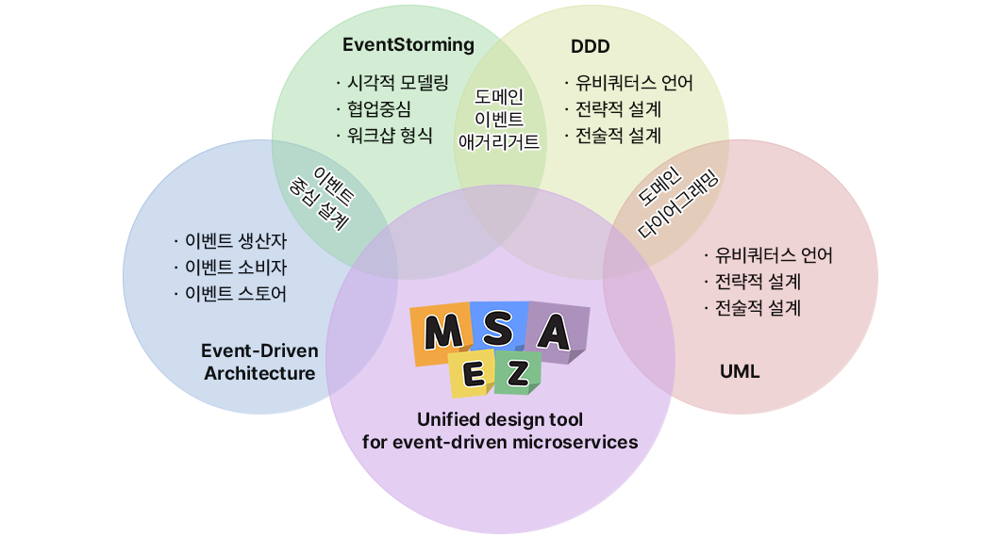
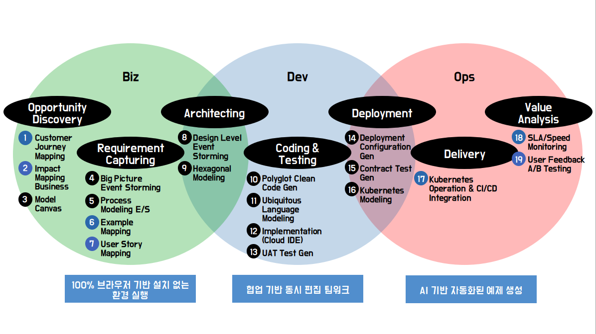

# 소개
[**MSAEZ**](https://labs.msaez.io/)는 이벤트 기반 아키텍처의 유연성, EventStorming을 통한 협업 중심 설계, DDD의 도메인 중심 설계 방식, 그리고 UML의 시각적 표현 도구를 효과적으로 결합한 통합 설계 도구입니다. 이를 통해 기업은 복잡한 마이크로서비스 아키텍처를 더 쉽게 설계하고 관리할 수 있습니다. MSA-Ez는 개발 팀과 비즈니스 팀 간의 소통을 원활하게 하고, 시스템 설계를 체계적으로 관리하며, 확장성과 유지보수성을 높이는 데 기여합니다. 빠른 피드백과 효율적인 설계를 가능하게 하여, 마이크로서비스 아키텍처에서 복잡성을 줄이고 성공적인 소프트웨어 개발을 위한 강력한 지원을 제공합니다.

MSAEZ는 마이크로서비스의 분석, 설계, 구현 및 운영을 지원하도록 설계된 통합 플랫폼입니다. 이 플랫폼을 통해 비즈니스 전문가와 개발자는 도메인 중심 설계 및 이벤트스토밍 기술을 사용하여 대상 도메인을 공동으로 분석하고 설계할 수 있습니다. 또한 설계된 서브 도메인별로 클린 아키텍처(Clean Architecture)를 기반으로 하는 소스 코드의 자동 생성이 가능합니다. 

MSAEZ는 전 라이프사이클에 걸쳐 ChatGPT를 활용한 자동화 및 가이드 기능을 지원하고 있어 애자일한 클라우드 네이티브 애플리케이션 구현에 필요한 최적의 수행 환경을 제공합니다.

MSAEZ는 Biz-Dev-Ops 풀 라이프사이클을 지원합니다. 설치가 필요없이 100% 브라우저 기반에서 동작하며 협업기반의 팀워크를 지원하는 최신의 OpenAI 엔진들이 탑재되어 비즈니스 기획자, 데브옵스 개발자, 클라우드 운영자를 위애 비즈니스 기획에서 구현, 테스트, 배포를 아우르는 클라우드 네이티브한 task들을 자동화하며 다양한 애자일한 경험들을 제공합니다.  

    <a target="_blank" href="https://cdn2.me-qr.com/pdf/5eff277d-ec9d-448f-9d44-50397de259bb.pdf">MSAEZ 브로슈어 다운로드</a>

## MSAEZ 주요 기능

- **온라인 이벤트스토밍 협업 툴**

이벤트 스토밍(Event Storming)은 도메인에서 발생하는 주요 이벤트를 중심으로 도메인 모델을 만드는 DDD(도메인 주도설계)에 기원한 방법론입니다. 이는 개발자 뿐만 아니라 모든 이해관계자들이 참여하여 서비스에서 발생하는 이벤트를 정의하고, 그 이벤트가 어떻게 발생하는지, 이벤트에 따른 상호작용이 무엇인지를 이해하려는 접근 방식입니다.

MSAEZ는 이벤트스토밍에 필요한 스티커 노트(Sticky Note, 포스트잇)과 화이트 보드를 웹 브라우저에서 실행하고 협업을 위한 다양한 사용자 경험과 인터페이스를 제공합니다.  

- **템플릿 기반 클린코드 자동 생성**

템플릿 엔진(Template Engine)이란 지정된 양식을 가진 템플릿과 데이터가 합쳐져서 새로운 형태의 산출물, 이를테면 DSL(도메인 전용 언어)로 변환해 주는 도구을 말합니다. 

MSAEZ가 기본 제공하는 머스테치(Mushtache) 엔진기반 템플릿을 활용하여 비즈니스 개발자는 설계된 모델로부터 스켈레톤 코드를 쉽게 자동 생성할 수 있으며, 마이크로서비스 패턴을 지원하는 다양한 기능(a.k.a Topping)들을 옵션 형태로 추가할 수 있습니다.

- **커스텀 템플릿 지원**

MSAEZ에는 기본 내장하고 있는 DSL 템플릿(Java, Python, Go, NodeJS, Spring-boot-Mybatis, Spring-boot-JPA) 이외에도 개발자가 직접 정의하여 적용할 수 있도록 하는 커스텀 템플릿(Custom Template) 생성이 가능합니다. 이를 위해 커스텀 템플릿 생성에 필요한 상세 가이드라인과 메뉴얼을 제공합니다. 이로써 마이크로서비스를 적용하려는 수요기관에 최적화된 프레임워크 활용이 가능해 집니다.

- **OpenAI 기반 최신의 전문경험 서포트**

기획된 비즈니스를 검증하고, 검증된 비즈니스에 대한 프로토타입을 구현한 뒤 빠른 시장의 출시와 피드백으로 제품 완성도를 높이기 위해 무엇보다 중요한 요소는 '사용자 경험'입니다. MSAEZ는 애자일한 제품(마이크로서비스)개발을 위해 ChatGPT를 포함한 전문 OpenAI 엔진들을 활용하여 이벤트스토밍 자동화, 비즈니스 로직 자동생성, 자동 테스팅/디버깅 등 검증된 도메인 시나리오, 실전 적용 가능한 최신 로직들을 전 단계에 걸쳐 사용하기 쉽게 MSAEZ 도구내에서 인터페이스를 제공하고 있습니다.

- **형상서버 연계와 클라우드 IDE 활용**

MSAEZ는 모델기반으로 생성된 코드를 GIT 기반 Repository와 연계하여 저장할 수 있도록 지원합니다. MSAEZ 사용자가 GitHub 계정으로 로그인하게 되면 이벤트스토밍 모델로부터 자동 생성된 코드는 MSAEZ가 제공하는 저장소 연계 UI를 통해 실시간 내 Git Repository에 Commit/Push되어 형상 관리됩니다. 또한 Repository의 코드들을 클라우드 IDE(GitPod, CODESPACE) 상에 즉시 로딩해 데브옵스 개발자가 비즈니스 로직을 구현하고 테스트가 가능하도록 에자일한 환경을 연동하여 지원하고 있습니다. 

데브옵스 개발자가 초기 버전 모델을 활용하여 비즈니스 로직을 구현하는 중에 이벤트스토밍 설계 정보가 바뀌더라도 형상서버의 브랜치 머지(Merge) 기능을 활용하여 설계와 구현간의 변경으로 인한 충돌을 Seamless하게 융합합니다.
