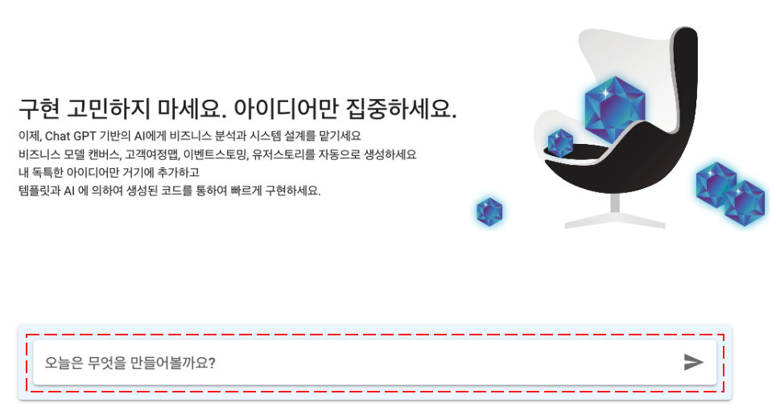
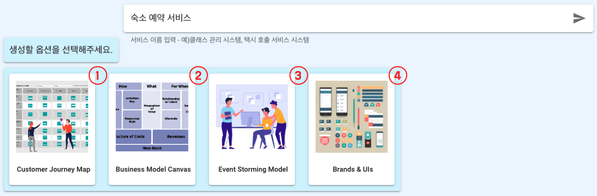

# 주요 기능

## 이벤트스토밍 모델 생성 기능

#### 수행 방법

아래 문서에서 자세한 이벤트스토밍 수행 예제를 확인해보실 수 있습니다.

[기본 예제](https://intro-kor.msaez.io/tool/event-storming-tool/) 

[심화 예제](https://intro-kor.msaez.io/tool/google-drive-examples/)

#### UI 레이아웃

|  | 이름                | 기능 설명                                                              |
|------|---------------------|----------------------------------------------------------------------- |
| 1    &nbsp;| Sticker Palette     | EventStorming을 위한 Sticky note를 선택할 수 있는 Palette        |
| 2    &nbsp;| Zoom Panel          | 캔버스에 작성된 화면을 확대, 축소, undo, redo 하는 기능                         |
| 3    &nbsp;| Project Name        | 프로젝트 명 입력 (Java의 경우 Package명)                         |
| 4    &nbsp;| Menu Panel             | 모델링 결과물을 다루는 다양한 옵션을 선택할 수 있는 도구들                            |
| 5    &nbsp;| Eventstorming Canvas     | Sticky note를 활용해 모델링하는 공간        |

#### 메뉴별 상세

1. Sticker Palette

|  | 이름                | 기능 설명                                                              |
|------|---------------------|----------------------------------------------------------------------- |
| 1    &nbsp;| Draggable Screen     | 캔버스를 드래그할 수 있도록 하는 on/off 기능 |
| 2    &nbsp;| Auto Guidance          | 모델링 시 자동 정렬 기능을 on/off 하는 기능 |
| 3    &nbsp;| Event        | 발생한 사실과 결과, 즉 Domain Event를 정의하는 스티커 |
| 4    &nbsp;| Command             | 의사결정 및 API를 의미하는 Command를 정의하는 스티커 |
| 5    &nbsp;| Policy     | 이벤트에 대한 반응으로 Policy를 정의하는 스티커 |
| 6    &nbsp;| Aggregate     | 구현체와 데이터의 집합체인 Aggregate를 정의하는 스티커 |
| 7    &nbsp;| External          | 외부 시스템 호출 정보를 정의하는 스티커 |
| 8    &nbsp;| ReadModel        | 유저 참고용 데이터인 ReadModel을 정의하는 스티커 |
| 9    &nbsp;| Issues             | 작성된 모델에 대한 수정 및 요청사항을 작성하는 스티커 |
| 10    &nbsp;| UI     | UI 정보를 정의하는 스티커 |
| 11   &nbsp;| BoundedContext     | 각 마이크로서비스의 단위를 구분하는 틀 |
| 12    &nbsp;| PBC          | 서버에 저장된 기존의 모델을 불러와 사용할 수 있는 기능 |
| 13    &nbsp;| Actor        | 본 서비스의 사용자, 페르소나, 스테이크홀더 |
| 14    &nbsp;| Line             |  |
| 15    &nbsp;| Text     |  |

2. Menu Panel

|  | 이름                | 기능 설명                                                              |
|------|---------------------|----------------------------------------------------------------------- |
| 1    &nbsp;| Deploy | 모델링 결과를 쿠버네티스 배포 모델로 전환 |
| 2    &nbsp;| Versions | 모델의 버전 정보를 조회하고 Replay 기능 사용 가능 |
| 3    &nbsp;| Save | 모델링 결과를 서버에 저장하거나 로컬 json 파일, 파워포인트 문서로 저장 |
| 4    &nbsp;| Share | 모델링 결과를 다른 사용자와 공유 |
| 5    &nbsp;| View | 모델링 UI를 헥사고날 혹은 BPMN으로 변경하여 조회 |
| 6    &nbsp;| Code | 모델을 기반으로 생성된 소스코드를 Git에 커밋하거나 로컬 파일로 다운로드 |

---

## 템플릿 기반 소스코드 생성 기능

#### 수행 방법

이벤트스토밍 모델 생성이 완료 되면 상단 Menu Panel에서 CODE 버튼을 클릭해 소스 코드를 생성합니다.

|  | 이름                | 기능 설명                                                              |
|------|---------------------|----------------------------------------------------------------------- |
| 1    &nbsp;| Menu Panel | Git 연동, 템플릿 수정, 파일 다운로드 등의 기능 사용 가능 |
| 2    &nbsp;| Source Tree | 모델을 기반으로 생성된 전체 파일리스트 표시 |
| 3    &nbsp;| Source Code | 선택한 파일의 소스코드 표시 |
| 4    &nbsp;| Explain Code | Chat GPT 연동으로 해당 코드에 대한 설명을 텍스트로 안내 |

 Explain Code 화면 (예시) 

#### Menu Panel 상세

|  | 이름                | 기능 설명                                                              |
|------|---------------------|----------------------------------------------------------------------- |
| 1    &nbsp;| Push to Git | 사용자의 GitHub 계정과 연결해 레포지토리 생성 및 GitPod IDE 연동 |
| 2    &nbsp;| Edit Template | 적용된 템플릿 파일을 직접 수정 |
| 3    &nbsp;| Design Patterns |  |
| 4    &nbsp;| Download Archive | 전체 소스코드를 로컬 파일로 다운로드 |
| 5    &nbsp;| Search | 파일명 검색 기능 활성화 |
| 6    &nbsp;| Diff Mode | 사용자가 원본 코드를 수정하면 수정본의 변경사항을 표시 |
| 7    &nbsp;| Explain Project | 프로젝트에 대한 설명 제시 |

---

## Chat GPT 기반 비즈니스 설계 기능

#### 수행 방법

MSAEZ의 메인 화면에 있는 입력창에 만들고자 하는 서비스 유형을 입력하면 4개의 옵션이 제시됩니다.

 

|  | 이름                | 기능 설명                                                              |
|------|---------------------|----------------------------------------------------------------------- |
| 1  | Customer Journey Map | 페르소나를 분석해 서비스와 맞닿는 지점을 분석하는 마케팅 기법 |
| 2 | Business Model Canvas | 비즈니스 운영 시에 필요한 요소들을 다이어그램으로 정리한 도표 |
| 3 | EventStorming Model | 도메인 이벤트를 중심으로 비즈니스 모델을 구현 |
| 4 | Brands & UIs | 전체 소스코드를 로컬 파일로 다운로드 |

각 옵션을 선택하면 Chat GPT 기반 AI 서비스로 자동으로 해당 비즈니스 설계 모델이 생성됩니다.

자세한 수행 방법은 [여기](https://intro-kor.msaez.io/tool/chat-gpt/)에서 확인하실 수 있습니다.