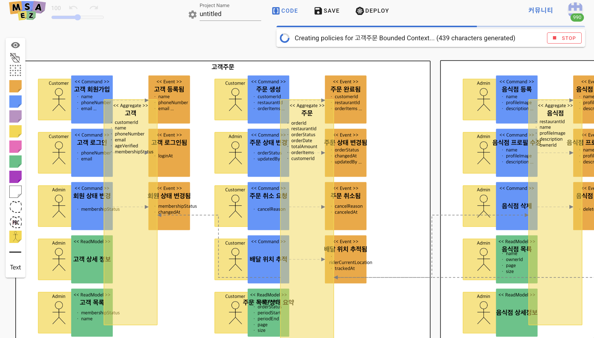

# Vibe Coding

현대 비즈니스 환경에서는 시장이 빠르게 변화하며 기업들이 이에 민첩하게 대응해야 합니다. 이러한 상황에서 AI를 활용한 개발 방식은 더 이상 선택이 아닌 필수가 되었습니다.<br>
**Vibe Coding**은 AI를 활용하여 소프트웨어 개발 생명주기 전반을 지원하는 혁신적인 접근법입니다. 비즈니스 요구사항을 직접 분석하고 이를 설계 모델로 변환한 후, 실제 구현 코드까지 자동으로 생성함으로써 개발 과정을 크게 단축하고 일관성을 유지합니다.<br>
특히 마이크로서비스 아키텍처와 같은 복잡한 시스템 설계에서 AI의 활용은 핵심적인 가치를 제공합니다. Vibe Coding을 통해 복잡한 비즈니스 도메인을 효과적으로 분석하여 적절히 분할하고, 요구사항에 맞는 이벤트스토밍을 설계하며, 고품질의 코드를 자동으로 생성할 수 있습니다. 이로써 기업은 시장 출시 시간을 단축하고 비즈니스 민첩성을 확보하여 경쟁 우위를 달성할 수 있습니다.<br>

## 1. Vibe coding을 활용한 분석/설계
음식배달앱 서비스를 Vibe Coding을 활용하여 요구사항에 따른 분석을 진행하는 방법은 다음과 같습니다.

### 1) MSAEZ 모델링 도구 접속
- 크롬 브라우저를 실행하고 https://www.msaez.io 에 접속합니다.
- 우측 상단의 아바타 아이콘을 클릭하여 **깃헙(Github)** 계정으로 로그인을 진행 합니다.
- **오늘은 무엇을 만들어볼까요?** 창에 서비스의 이름인 **음식 배달 앱**을 입력 후, Enter를 입력합니다.


### 2) 유저스토리 생성
서비스 분석의 첫 단계인 기능 및 요구사항 명세를 유저스토리로 생성합니다.
- **AI로 생성** 버튼을 클릭하여 아래와 같이 음식 배달 앱의 유저스토리를 생성합니다.

생성이 완료되면 아래와 같이 서비스에 대하여 기능 요구사항을 작성되고 입려한 서비스를 이용하는 대상별 어떠한 비즈니스 가치를 제공하는지를 가치중심으로 작성하여 보여줍니다.


### 3) 프로세스 및 이벤트 흐름 생성
유저스토리의 생성이 완료되면, 유저스토리를 기반으로 BPM(usiness Process Management)을 생성합니다.
- **'요구사항 검증'** 버튼을 클릭합니다.
생성이 완료되면 아래와 같이 이전에 생성된 유저스토리를 기반으로 서비스의 액터별 진행되는 프로세스가 정의되고 이를 통해 서비스 이용에 있어 실질적인 업무 흐름을 파악할 수 있습니다.


### 4) Bounded Context 분할 설정 및 생성
'Bounded Context 생성'을 클릭하면 서비스를 분할에 대한 설정을 진행할 수 있습니다. 이 단계에서는 다음의 설정을 진행합니다.
- 마이크로서비스 관점에서 서비스를 분리할 갯수를 설정합니다.
- 다양한 관점을 고려하여 서비스 경계를 설정합니다.
- 모든 설정을 마친 후 '생성' 버튼을 클릭하여 설정한 요구사항에 따른 Bounded Context 분할을 진행합니다.

생성이 완료되면 Bounded Context의 분할 결과가 다음과 같이 여러 섹션으로 생성됩니다.

1. Bounded Context 연관 관계도 <br>
    설정한 Bounded Context의 수와 관점에 따라 분할된 Bounded Context간의 관계를 나타냅니다. <br>
    도메인은 Core, Supporting, Generic 영역으로 분리되며, 각 서비스간의 연결 관계(동기, 비동기)를 확인할 수 있습니다.


2. Core Domain Chart
    분할된 서비스를 비즈니스 차별성, 모델 복합도를 관점으로 우선순위를 배치합니다. <br>
    Core domain일수록 비즈니스 차별성이 높으며 Generic domain일 경우 모델 복합성이 높아지는 것을 확인할 수 있습니다.


### 5) Aggregate 초안 생성
분할된 Bounded Context별 정의될 어그리거트의 초안을 생성합니다. 
- '어그리거트 초안 생성'을 진행합니다. <br>

초안이 생성되면 아래와 같이 고객 주문 서비스를 위한 어그리거트의 상세 설계와 다른 어그리거트 와의 관계가 생성된 것을 확인할 수 있습니다.<br>


이를 통해 요구사항으로부터 핵심 개념과 역할, 책임을 분석할 수 있고 애그리거트 후보 자동 도출을 통해 리드타임을 단축할 수 있습니다.

### 6) 이벤트스토밍 모델 설계
분석/설계의 마지막 단계로 생성된 어그리거트의 초안들을 기반으로 이벤트스토밍 모델을 설계합니다.
- '이벤트스토밍 모델 생성'을 클릭합니다. <br>

모델의 생성이 시작되면 유저스토리와 분할된 Bounded Context, 애그리거트 초안 등 분석 단계에서 AI를 통해 생성된 결과를 기반으로 요구사항에 부합되는 이벤트스토밍 모델이 아래와 같이 생성됩니다.


생성된 이벤트스토밍은 도메인 이벤트 중시 업무 흐름을 시각화 할 수 있고 각 스티커간의 연관 관계를 자동으로 구성 하여 도메인 주도 설계(DDD)를 실현할 수 있습니다.

### 7) PDF 산출물 자동 생성
분석/설계 단계에서 생성한 산출물을 PDF 자동 생성 기능을 통해 문서화할 수 있습니다.

- 이전 분석단계를 진행한 화면으로 이동 후, 현재까지의 결과물을 저장하기 위해 우측 상단 '저장' 버튼을 클릭합니다. <br>


- 이후 저장된 화면에서 'Export to PDF' 버튼을 클릭하면 분석/설계 단계의 산출물이 자동으로 PDF형식으로 생성됩니다.


이를 통해 일관된 문서형식을 제공하여 가독성을 높이고 문서화 작업 시간을 단축하여 문서 품질의 표준화를 제공합니다.

## 2. Vibe coding을 활용한 구현
음식배달앱 분석/살계를 최종 생성된 이벤트스토밍 모델과 Vibe Coding을 활용한 모델 기반 구현 코드 생성을 진행하는 방법은 다음과 같습니다.

### 1) Vibe Coding Template 적용
- **'CODE'** 버튼을 클릭하면 브라우저 우측에 Code Preview 화면이 생성됩니다.


- **Base: template-spring-boot** 를 클릭 후, 'MARKETPLACE'를 클릭합니다.

- 아래와 같이  **'Vibe Coding for Spring boot'** 를 선택한 후, 'APPLY'를 클릭합니다.


### 2) 프로젝트 생성
Vibe Coding Template을 적용한 프로젝트를 다운로드하여 Local에서 프로젝트를 실행합니다.

- Code Preview 화면 상단의 **'아카이브 다운로드'**를 클릭하여 다운로드를 진행합니다.

- 생성된 프로젝트를 Local IDE(Cursor, VSCode...)를 실행하여 다운로드 받은 파일을 선택하여 프로젝트를 엽니다.

- 생성된 파일 중 ClineREADME 파일을 클릭하여 안내된 단계를 실행합니다.

```
// directory 영역 우클릭 > 터미널을 생성(Open in Intergrated Terminal)한 후, 아래 커맨드 실행
// 폴더명 변경
mv vibe-coding-rules .clinerules

// 파일 확장자 변경
cd .clinerules
for file in *.mdc; do mv -- "$file" "${file%.mdc}.md"; done
```
완료 후, 파일을 확인해보면 .clinerules 폴더 하위에 md확장자 파일이 생성됩니다.
해당 md 파일들은 생성 규칙, 패키지 구조, 기술 스택, 테스트 파일 생성 규칙, 이벤트스토밍 스티커 규칙 등이 존재 하며, <br>
Vibe Coding에서 코드를 구현할 때 Prompt와 함께 전달되어 요구사항을 준수하는 코드를 생성하는데 도움을 줍니다.

### 3) Cline 설치 및 생성
모델 기반 Vibe Coding을 진행하기 위해 폐쇄형 LLM인 Cline을 설치하는 방법은 다음과 같습니다.

- 아래와 같이 Extension을 선택합니다.


- 검색창에 **'Cline'** 을 검색하여 선택한 후, **'Install'** 을 클릭하여 Cline Extension을 설치합니다.

- 설치가 완료되면 Cline 아이콘이 생성되며, 클릭하면 아래와 같운 화면이 생성됩니다.


- Use your Own API key를 클릭한후 나오는 설정에서 다음과 같이 설정을 진행한 후, 'DONE'을 눌러 저장합니다.

    Base URL: http://ai-server.dream-flow.com:30000/v1
    API KEY: 테스트용 값 입력(‘12345678’)
    Model: 설정된 모델의 표시 이름 (‘QWen2.5’)

### 4) Prompt를 통한 코드 생성
이전에 생성한 모델의 정보(메타데이터)와 Prompt, Rules 파일을 활용하여 Vibe Coding을 진행합니다. 방법은 다음과 같습니다.

- 각 Bounded Context 폴더 하위의 PRD.txt를 클릭합니다.
- PRD.txt 내용을 복사한 후, Cline으로 이동합니다.
- 영역 하단의 **'Type your task here...'** 에 복사한 내용을 붙여넣기 후, 'Enter'를 입력합니다.

입력이 완료 되면, Cline에 입력한 Prompt와 .clinerules하위에 생성된 파일들을 기반으로 아래와 같이 코드를 생성하는 것을 확인할 수 있습니다.


이처럼 Vibe Coding을 활용한 분석/설계, 구현 방식은 사용자의 비즈니스 요구사항을 빠르게 분석하고, 효율적인 마이크로서비스 아키텍처를 설계하며, 높은 품질의 코드를 생성하는데 큰 도움이 됩니다. <br>

