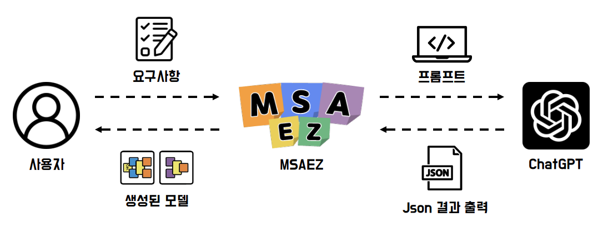

# AI 기반 모델 생성

	<iframe style="position: absolute; top: 0; left: 0; width: 100%; height: 100%;" 
        src="https://www.youtube.com/embed/HSMEgOJj3Co" 
        frameborder="0" crolling="no" frameborder="none" allowfullscreen="">
    </iframe>

 

## Open AI 기술을 활용한 비즈니스 설계 모델 생성

비즈니스 설계 과정의 필수 스텝인 고객 여정맵과 비즈니스 모델 캔버스, 기존 MSAEZ의 핵심 기능인 이벤트스토밍 모델 생성을 ChatGPT를 연동해 자동으로 생성함으로써 설계 과정의 시간을 절약하고 보다 효율적인 비즈니스 경험을 제공합니다.

## 수행 방법
MSAEZ의 메인 화면에 있는 입력창에 만들고자 하는 서비스 유형을 입력하면 4개의 옵션이 제시됩니다.

 

1. 입력창에 만들고자 하는 서비스를 입력합니다. (예시 : 숙소 예약 서비스, 음식 배달 서비스 등)

<table class="responsive-table">
    <thead>
        <tr>
            <th>번호</th>
            <th>이름</th>
            <th>기능 설명</th>
        </tr>
    </thead>
    <tbody>
        <tr>
            <td>1</td>
            <td>Customer Journey Map</td>
            <td>페르소나를 분석해 서비스와 맞닿는 지점을 분석하는 마케팅 기법</td>
        </tr>
        <tr>
            <td>2</td>
            <td>Business Model Canvas</td>
            <td>비즈니스 운영 시에 필요한 요소들을 다이어그램으로 정리한 도표</td>
        </tr>
        <tr>
            <td>3</td>
            <td>EventStorming Model</td>
            <td>도메인 이벤트를 중심으로 비즈니스 모델을 구현</td>
        </tr>
        <tr>
            <td>4</td>
            <td>Brands & UIs</td>
            <td>전체 소스코드를 로컬 파일로 다운로드</td>
        </tr>
    </tbody>
</table>

1. Customer Journey Map

페르소나를 분석해 서비스와 맞닿는 지점을 분석하는 마케팅 기법

2. Business Model Canvas

비즈니스 운영 시에 필요한 요소들을 다이어그램으로 정리한 도표

3. EventStorming Model

도메인 이벤트를 중심으로 비즈니스 모델을 구현

4. Brands & UIs

전체 소스코드를 로컬 파일로 다운로드

  

2. 고객 여정맵, 비즈니스 모델 캔버스, 이벤트스토밍 모델, 브랜드&UI 중 생성하고자 하는 옵션을 선택합니다.

### 고객 여정맵

3-1. 해당 서비스의 예상 소비자에 대한 페르소나를 선택합니다. 

3-2. 선택한 페르소나에 대한 고객 행동 시나리오가 생성되면 CREATE MODEL 버튼을 클릭합니다(시나리오는 수정 가능).

3-3. 해당 페르소나의 요구사항을 반영한 고객 여정맵이 자동으로 생성됩니다.
 
### 비즈니스 모델 캔버스

4-1. 비즈니스 모델 캔버스 CREATE MODEL 버튼을 클릭합니다. 

4-2. 해당 비즈니스를 구성하는 요소들을 ChatGPT가 자동으로 추천해 모델화합니다.

### 이벤트스토밍 모델

5-1. 이벤트스토밍 모델을 선택하면 입력한 서비스에 대한 유저스토리가 생성됩니다. 

5-2. CREATE MODEL 버튼을 클릭하면 해당 비즈니스를 구성하는 도메인 이벤트를 ChatGPT가 자동으로 생성합니다.

5-3. Generate Aggregate 버튼을 클릭하면 앞서 생성된 도메인 이벤트를 기반으로 전체 이벤트스토밍 모델이 생성됩니다.

