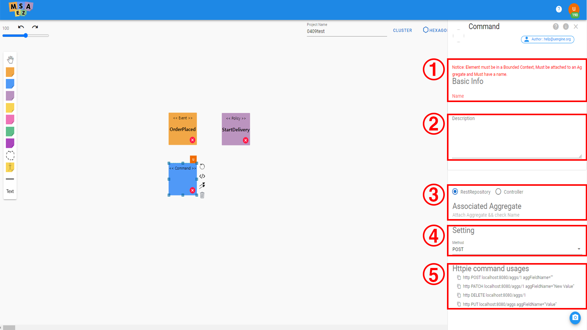
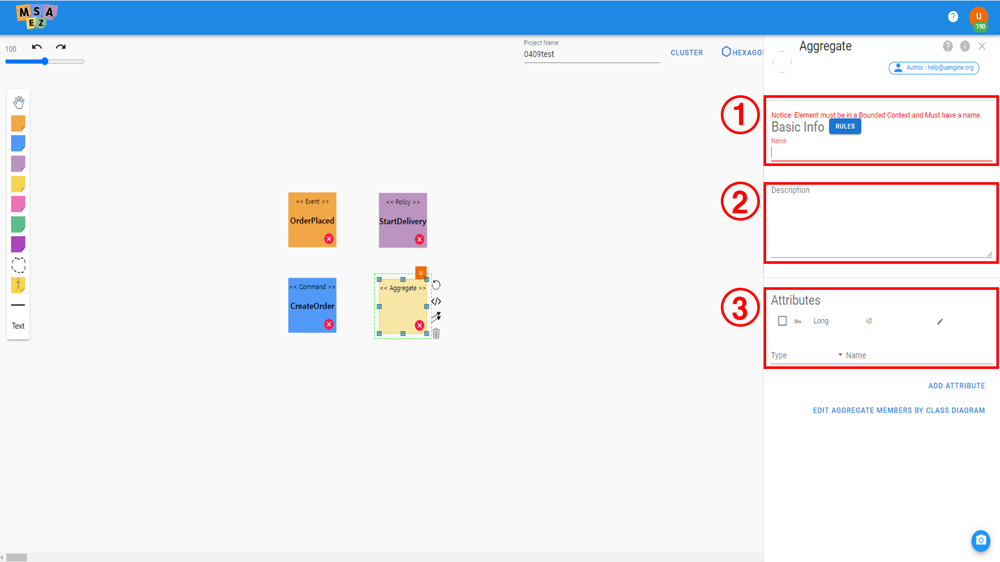

# 이벤트스토밍

아래 문서에서 자세한 이벤트스토밍 수행 예제를 확인해보실 수 있습니다.

[기본 예제](https://intro-kor.msaez.io/tool/event-storming-tool/) 

[심화 예제](https://intro-kor.msaez.io/tool/google-drive-examples/)

#### UI 레이아웃

|  | 이름                | 기능 설명                                                              |
|------|---------------------|----------------------------------------------------------------------- |
| 1    &nbsp;| Sticker Palette     | EventStorming을 위한 Sticky note를 선택할 수 있는 Palette        |
| 2    &nbsp;| Zoom Panel          | 캔버스에 작성된 화면을 확대, 축소, undo, redo 하는 기능                         |
| 3    &nbsp;| Project Name        | 프로젝트 명 입력 (Java의 경우 Package명)                         |
| 4    &nbsp;| Menu Panel             | 모델링 결과물을 다루는 다양한 옵션을 선택할 수 있는 도구들                            |
| 5    &nbsp;| Eventstorming Canvas     | Sticky note를 활용해 모델링하는 공간        |

#### 메뉴별 상세

1. Sticker Palette

|  | 이름                | 기능 설명                                                              |
|------|---------------------|----------------------------------------------------------------------- |
| 1    &nbsp;| Draggable Screen     | 캔버스를 드래그할 수 있도록 하는 on/off 기능 |
| 2    &nbsp;| Auto Guidance          | 모델링 시 자동 정렬 기능을 on/off 하는 기능 |
| 3    &nbsp;| Event        | 발생한 사실과 결과, 즉 Domain Event를 정의하는 스티커 |
| 4    &nbsp;| Command             | 의사결정 및 API를 의미하는 Command를 정의하는 스티커 |
| 5    &nbsp;| Policy     | 이벤트에 대한 반응으로 Policy를 정의하는 스티커 |
| 6    &nbsp;| Aggregate     | 구현체와 데이터의 집합체인 Aggregate를 정의하는 스티커 |
| 7    &nbsp;| External          | 외부 시스템 호출 정보를 정의하는 스티커 |
| 8    &nbsp;| ReadModel        | 유저 참고용 데이터인 ReadModel을 정의하는 스티커 |
| 9    &nbsp;| Issues             | 작성된 모델에 대한 수정 및 요청사항을 작성하는 스티커 |
| 10    &nbsp;| UI     | UI 정보를 정의하는 스티커 |
| 11   &nbsp;| BoundedContext     | 각 마이크로서비스의 단위를 구분하는 틀 |
| 12    &nbsp;| PBC          | 서버에 저장된 기존의 모델을 불러와 사용할 수 있는 기능 |
| 13    &nbsp;| Actor        | 본 서비스의 사용자, 페르소나, 스테이크홀더 |
| 14    &nbsp;| Line             |  |
| 15    &nbsp;| Text     |  |

2. Menu Panel

|  | 이름                | 기능 설명                                                              |
|------|---------------------|----------------------------------------------------------------------- |
| 1    &nbsp;| Deploy | 모델링 결과를 쿠버네티스 배포 모델로 전환 |
| 2    &nbsp;| Versions | 모델의 버전 정보를 조회하고 Replay 기능 사용 가능 |
| 3    &nbsp;| Save | 모델링 결과를 서버에 저장하거나 로컬 json 파일, 파워포인트 문서로 저장 |
| 4    &nbsp;| Share | 모델링 결과를 다른 사용자와 공유 |
| 5    &nbsp;| View | 모델링 UI를 헥사고날 혹은 BPMN으로 변경하여 조회 |
| 6    &nbsp;| Code | 모델을 기반으로 생성된 소스코드를 Git에 커밋하거나 로컬 파일로 다운로드 |

---

<h2>MSAEZ로 마이크로서비스 개발하기</h2>

## 서비스 접속
[MSAEZ](http://www.msaez.io)에 접속합니다. ****크롬 브라우저 추천****

<h2>예제 프로젝트</h2>

예제 프로젝트는 주문 서비스와 배송 서비스 2개의 서비스를 EventStorming하여 Spring-boot로 실행되는 Java Project를 생성하고 이들을 구글클라우드의 쿠버네티스에 자동 배포하는 과정입니다.

### ·	Event Sticker
스티커 팔레트에서 오렌지색 아이콘이 Event를 지칭합니다.

<h4>Event 속성 설정</h4>

추가된 Event 스티커를 더블 클릭하면 오른쪽에 아래와 같이 속성 창이 나타나며, 각 속성 설정에 대한 값은 아래와 같습니다.

|  | 이름                 | 기능 설명                            |
| ---- | -------------------- | ------------------------------------ |
| 1    | Event Name           | Event Sticky note에 작성될 이름      |
| 2    | Attributes            | Event의 Attribute들 등록             |
| 3    | Trigger              | Event를 발생시키는 엔티티의 Trigger  |
| 4    | Associated Aggregates | Event와 연결 될 Aggregate 선택       |

주문팀의 주문 시나리오에 따라 아래와 같이 기입합니다.

1.  Event Name에 **OrderPlaced** 라고 기입합니다.

2.  Trigger는 **PrePersist**를 선택합니다.

3.  Attribute는 Event에서 사용할 Entity를 등록합니다. 기본적으로는 아래의 4. 에서 Aggregate가 연결되면 해당 Aggregate의 Entity정보를 참조합니다.

4.  연결될 Aggregate를 선택합니다. (이후에, Aggregate를 추가한 후에 선택하여 줍니다.)

배송팀은 배송 시나리오에 따라 Event를 생성하여 줍니다.

1.  Event Name에 **DeliveryStarted** 라고 기입합니다.

2.  Trigger는 **PostUpdate**를 선택합니다.

3.  Attribute는 Event에서 사용할 Entity를 등록합니다. 기본적으로는 아래의 4. 에서 Aggregate가 연결되면 해당 Aggregate의 Entity정보를 참조합니다.

4.  연결될 Aggregate를 선택합니다. (이후에, Aggregate를 추가한 후에 선택하여 줍니다.)

### ·	Policy Sticker

스티커 팔레트에서 라일락색 아이콘이 Policy를 지칭합니다.

<h4>Policy 속성 설정</h4>

추가된 Policy 스티커를 더블 클릭하면 오른쪽에 아래와 같이 속성 창이 나타나며, 각 속성 설정에 대한 값은 아래와 같습니다.

|  | 이름                   | 기능 설명                        |
| ---- | ---------------------- | -------------------------------- |
| 1    | Policy Name            | Policy Sticky note에 작성될 이름 |
| 2    | Saga            | Saga 형태의 모델을 그릴 때 중앙 Policy에 설정 |

해당 이벤트가 발생될 때의 업무에 따라서, 아래와 같이 기입합니다.

1.  Policy Name에 “**start delivery**” 라고 기입합니다.

2. Policy 스티커 옆의 화살표 2개 아이콘을 드래그해 ****DeliveryStarted** Event로 연결하여 relation을 생성해줍니다.

### ·	Command Sticker

스티커 팔레트에서 파란색 아이콘이 Command를 지칭합니다.

<h4>Command 속성 설정</h4>

추가된 Command 스티커를 더블 클릭하면 오른쪽에 아래와 같이 속성 창이 나타나며, 각 속성 설정에 대한 값은 아래와 같습니다.

|  | 이름                       | 기능 설명                         |
| ---- | -------------------------- | --------------------------------- |
| 1    | Command Name               | Command Sticky note에 작성될 이름 |
| 2    | Associated Aggregates       | Command와 연결 될 Aggregate 선택  |
| 3    | Method               | Restful API 의 CRUD Type을 선택   |
| 4    | Httpie command usages      | httpie에서 자주 사용 될 명령어 추천   |

해당 이벤트가 발생될 때의 업무에 따라서, 아래와 같이 기입합니다.

1.  Command Name에 “**order**” 라고 기입합니다.

2.  Restful Type은 POST로 설정합니다.

3.  연결될 Aggregate를 선택합니다. (이후에, Aggregate를 추가한 후에 선택하여 줍니다.)

4. Command 스티커 옆의 화살표 2개 아이콘을 드래그해 **OrdePlaced** Event로 연결하여 relation을 생성해줍니다.

### ·	Aggregate Sticker 

Aggregate는 스티커 팔레트에서 노란색 아이콘이 지칭합니다.

<h4>Aggregate 속성 설정</h4>

추가된 Aggregate 스티커를 더블 클릭하면 오른쪽에 아래와 같이 속성 창이 나타나며, 각 속성 설정에 대한 값은
아래와 같습니다.

|  | 이름              | 기능 설명                                      |
| ---- | ----------------- | ---------------------------------------------- |
| 1    | Aggregate Name    | Aggregate Sticky note에 작성될 이름            |
| 2    | Attributes        | Aggregate Entity (Domain Entity)를 정의합니다. |
| 3    | Edit Aggregate Members   by Class Diagram       | 클래스 다이어그램으로 Attributes를 정의합니다                       |

주문 서비스의 Aggregate(Domain Entity)를 정의하기 위해, 아래와 같이 기입합니다.

1.  Aggregate Name에 “**Order**” 라고 기입합니다.

2.  Aggregate의 Entity(Domain Entity)를 정의하여 줍니다.  
    해당 서비스에서는 Type은 String인 Name이라는 Entity를 추가하여 줍니다.

배송 서비스의 Aggregate(Domain Entity)를 정의하기 위해, 아래와 같이 기입합니다.

1.  Aggregate Name에 “**Delivery**” 라고 기입합니다.

2.  Aggregate의 Entity(Domain Entity)를 정의하여 줍니다.  
    해당 서비스에서는 Type은 String인 Address라는 Entity를 추가하여 줍니다.

Aggregate를 추가 하였다면 Order는 order Command와 OrderPlaced Event 사이에, 
  Delivery는 start delivery Policy와 DeliveryStarted Event 사이에 각각 위치시킵니다.

### ·	Bounded Context Sticker

Bounded Context는 스티커 팔레트에서 점선 모양의 아이콘이 지칭합니다.

<h4>Bounded Context 속성 설정</h4>

|  | 이름                            | 기능 설명                     |
| ---- | ------------------------------- | ----------------------------- |
| 1    | Bounded Context Name            | Bounded Context에 작성될 이름 |
| 2    | Bounded Context Authority       | Bounded Context의 권한을 부여할 유저 선택과 권한 부여 |

주문 서비스의 Bounded Context와 배송 서비스의 Bounded Context를 그린 후, 각각의 서비스에 맞게 EventStorming의 Sticky Note들을 각 Bounded Context에 Drag & Drop으로 넣어줍니다.

각 Bounded Context들의 name은 Order, Delivery로 입력해줍니다.

### ·	Relation

Relation은 Event 스티커에서 Policy 스티커로 연결되는 선을 지칭합니다.

<h4>마이크로서비스 간 Relation 추가</h4>

Event 스티커에서 화살표 모양 아이콘을 선택 또는 Drag 하여 연결될 Policy 스티커를 선택 또는 Drop하면 연결됩니다.

<h4>Relation 속성 설정</h4>

|  | 이름 | 기능 설명                                                                                                                   |
| ---- | -----| --------------------------------------------------------------------------------------------------------------------------- |
| 1    | Type | Event-Driven형식의 Pub/Sub 방식을 사용할 것인지,  또는 Request & Response 방식의 Restful API 방식을 사용할 것인지 설정 |

주문 서비스의 OrderPlaced의 이벤트가 발생할 경우 start delivery가 시작되도록 연결하되
 어떠한 방식으로 start delivery를 시작하게 할 것인지를 설정하여 줍니다.

1.  Event-Driven 방식의 Pub/Sub 방식으로 설정하여 줍니다.

<h4>EventStorming 결과</h4>

상기 작성된 작업들을 완료하면 아래와 같은 형태의 EventStorming 결과물이 나옵니다.

### ·	Code Preview

Code Preview를 선택하면 EventStorming 모델을 기반으로 생성된 소스코드를 확인 할 수 있습니다.

<h4>코드 프리뷰 레이아웃</h4>

|  | 이름               | 기능 설명                                                                            |
| -- | -------------------- | ------------------------------------------------------------------------------------ |
| 1 | Menu Panel | Git 연동, 템플릿 수정, 파일 다운로드 등의 기능 사용 가능 |
| 2 | Source Tree | 모델을 기반으로 생성된 전체 파일리스트 표시 |
| 3 | Source Code | 선택한 파일의 소스코드 표시 |
| 4 | Topping | Java/Spring Version, Security - Token based Authentication,  Kubernetes/Service Mesh등 설정 |

<h4>Menu Panel 상세</h4>

|  | 이름                | 기능 설명                                                              |
|------|---------------------|----------------------------------------------------------------------- |
| 1    &nbsp;| Push to Git | 사용자의 GitHub 계정과 연결해 레포지토리 생성 및 GitPod IDE 연동 |
| 2    &nbsp;| Edit Template | 적용된 템플릿 파일을 직접 수정 |
| 3    &nbsp;| Design Patterns |  |
| 4    &nbsp;| Download Archive | 전체 소스코드를 로컬 파일로 다운로드 |
| 5    &nbsp;| Search | 파일명 검색 기능 활성화 |
| 6    &nbsp;| Diff Mode | 사용자가 원본 코드를 수정하면 수정본의 변경사항을 표시 |
| 7    &nbsp;| Explain Project | 프로젝트에 대한 설명 제시 |

