# 모델 기반 UI 자동 생성

## 개요

마이크로서비스 아키텍처 설계에서 가장 중요한 과제 중 하나는 **설계와 구현 간의 일관성 유지**입니다. 이벤트스토밍을 통해 도출된 비즈니스 요구사항이 실제 사용자 인터페이스에 정확히 반영되고, 백엔드 서비스와 원활하게 연동되는 것은 프로젝트 성공의 핵심 요소입니다.

이러한 과제를 해결하기 위해 **스티커 기반 와이어프레임 생성** 기능을 제공합니다. 이벤트스토밍 모델에서 정의된 커맨드와 리드모델의 정보를 기반으로 AI가 자동으로 와이어프레임을 생성하고, 바이브 템플릿을 활용하여 **설계부터 구현까지의 완전한 자동화**를 실현합니다.

### 1) 와이어프레임 생성하기
음식배달 시나리오를 토대로 와이어프레임을 생성하는 방법은 다음과 같습니다.

먼저, 음식배달 시나리오 모델을 준비합니다. 
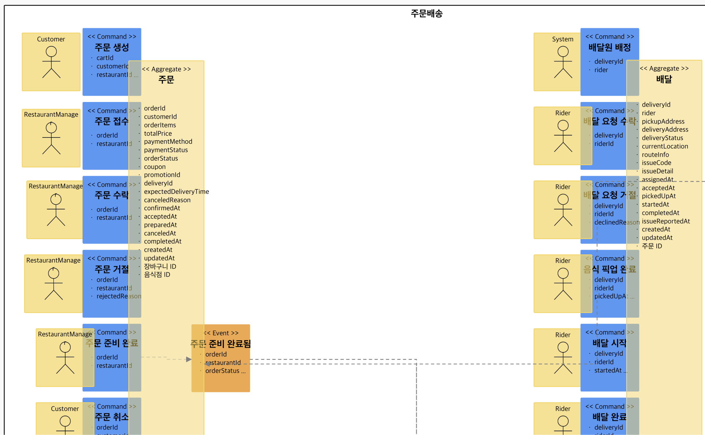

이후, 와이어프레임을 생성하기 위해 필요한 UI스티커를 부착합니다.  
이때, 와이어프레임은 커맨드, 리드모델 스티커에 한정하여 생성하기 때문에 커맨드의 경우 액터스티커와 커맨드 스티커 사이에, 리드모델 스티커 앞에 부착할 수 있습니다. 
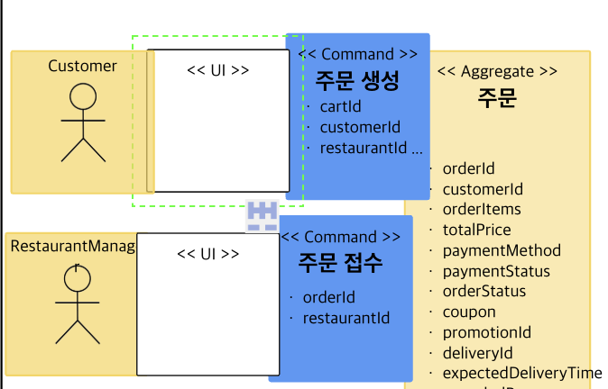
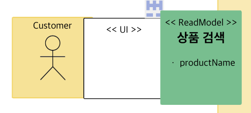

UI 스티커를 더블 클릭하여 생성된 패널에 이름을 입력한 후, 'GEN AI' 탭으로 이동하여 'Generate'를 통해 와이어프레임을 생성합니다.
요구사항이 없을 경우 연결된 커맨드, 리드모델 스티커의 정보를 기반하여 AI가 적합한 와이어프레임을 생성해주며, 요구사항을 추가할 경우 요구사항에 맞는 와이어프레임이 생성됩니다. 

 

### 2) 바이브 템플릿 적용하기
와이어프레임을 생성한다음 요구사항 기반 바이브코딩을 진행하기 위해 바이브템플릿을 적용합니다. 
CODE를 클릭하여 Code Viewer 화면을 생성한 다음, 'Base:'를 클릭 > 'MARKETPLACE'를 클릭을 통해 마켓플레이스 화면에 진입합니다. 
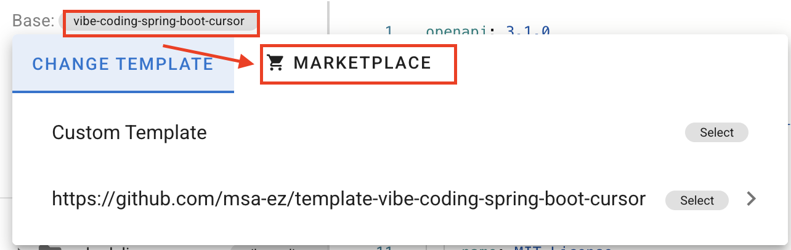

'TOPPINGS'탭에 위치한 'Vibe Template for React'를 클릭하고 Apply를 클릭하여 토핑을 적용합니다. 
이때, TEMPLATES 탭에 위치한 'Vibe Template for Spring Boot'를 적용하면 백엔드와 프론트엔드에 대한 바이브코딩을 진행할 수 있습니다. 
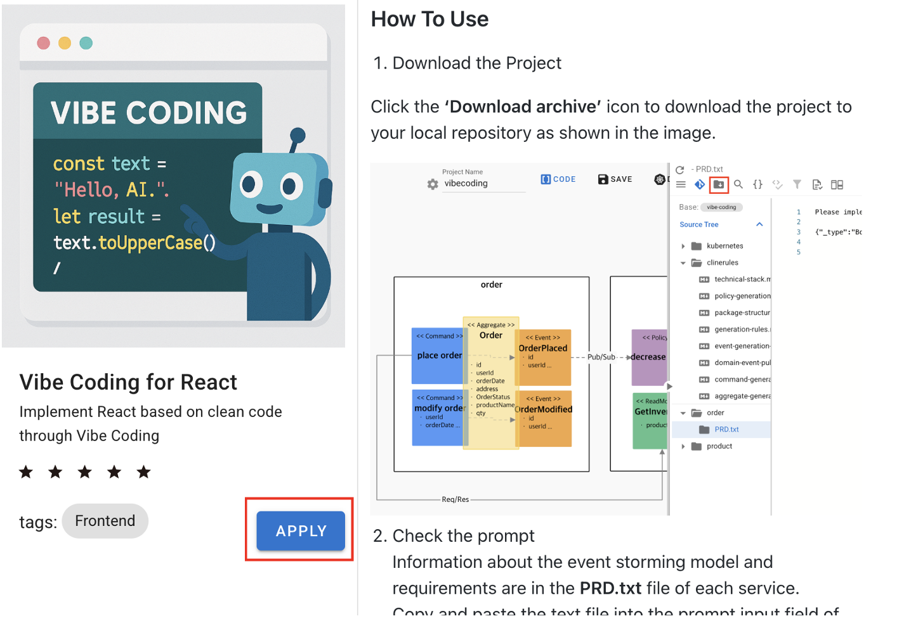

적용이 완료되면, 상단 메뉴중 '아카이브 다운로드'를 클릭하여 적용된 프로젝트를 다운 받을 수 있습니다. 
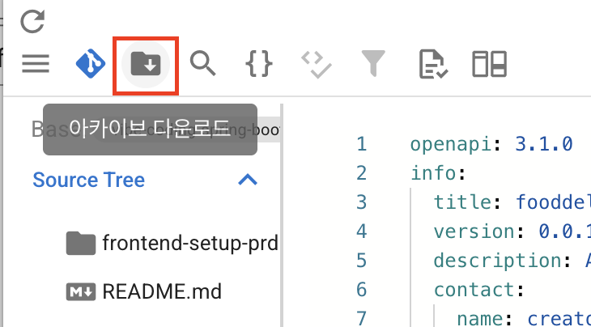

### 3) 바이브코딩 실행하기
바이브 템플릿이 적용된 프로젝트를 'Cursor IDE'를 통해 실행하면 아래와 같은 화면을 확인할 수 있습니다.
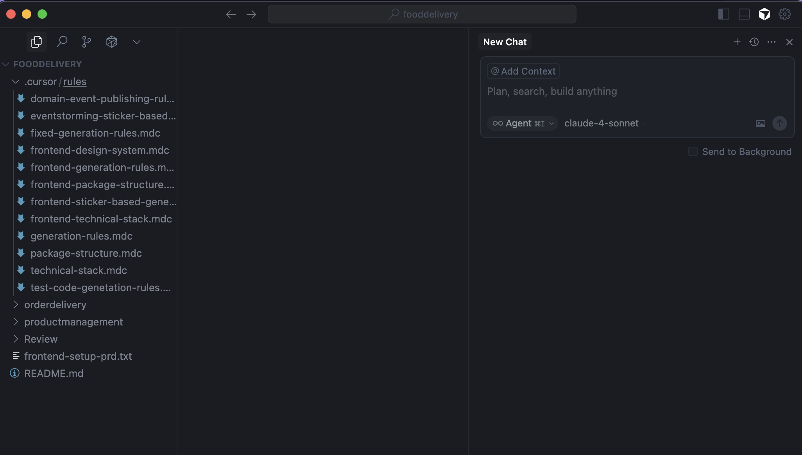

'Ctrl + L'을 입력하여 우측에 Cursor LLM 영역을 활성화합니다. 이후 단계에서 해당 Prompt영역에 템플릿/토핑 적용을 통해 생성된 PRD를 Prompt에 추가하여 바이브 코딩을 진행할 수 있으며 생성된 Rule과 PRD에 작성된 음식배달 시나리오 모델의 정보를 추출한 Metadata를 통해 요구사항에 맞는 코드 구현이 진행됩니다.

생성된 파일에 대한 설명은 다음과 같습니다.

1. Rule  
    .cursor/rules 하위에 생성된 파일들은 Cusor LLM이 동작할 때 Prompt를 제외한 기본적으로 적용됩니다. 따라서 바이브 코딩이 진행될 때, 프론트엔드 구현에 있어 일관성 유지 및 동작 가능한 애플리케이션을 생성하기 위한 요구사항들이 포함되어 있습니다.  
    대표적으로 기술 스택, 패키지 구조, 이벤트스토밍 스티커별 생성 예시, 디자인 예시, 생성 규칙이 있으며, 각각의 Rule은 바이브코딩이 진행됨에 따라 적절한 상황에 Rule이 적용되도록 처리되어있습니다. 
    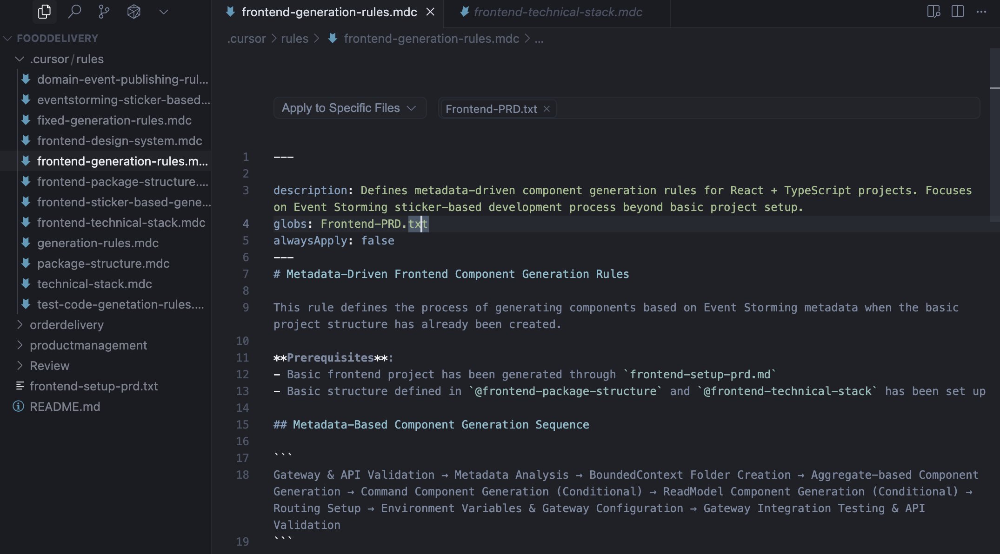

2. FrontendPRD.txt  
    Cursor AI 기반 바이브코딩을 진행할 때, Prompt역할을 하며, 동시에 이벤트스토밍 모델 기반 생성된 데이터를 제공하여 이를 통해 이벤트스토밍 모델에 따른 구현이 진행됩니다. 
    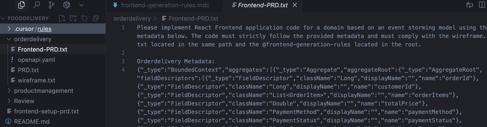

3. wireframe.txt  
    UI스티커를 통해 생성한 와이어프레임에 대한 HTML 코드를 제공하며 이를 통해 바이브코딩이 진행될 때, 요구사항 기반 생성된 와이어프레임의 실제 UI가 구현됩니다. 
    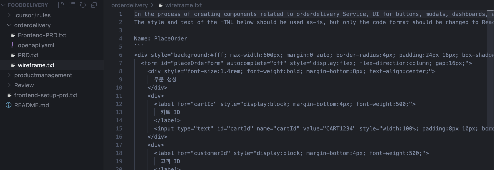

4. openapi.yaml  
    설계 단계에서 생성한 Command기반 API 명세에 대한 내용으로 바이브코딩이 진행될 때, 생성되는 버튼 및 화면상에 필요한 API를 제시하고 뱍엔드와의 통신에 있어 일관성있는 API를 제공하는 역할을 담당합니다. 
    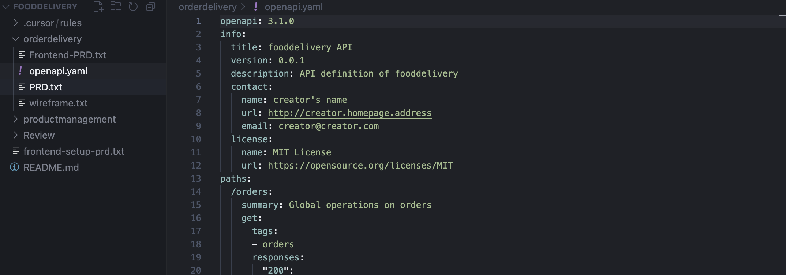

### 4) 프론트엔드 기본 구조 생성하기
프론트엔드 구현에 앞서 frontend-setup.txt에 작성된 내용을 Prompt 영역에 복사 및 붙여넣기를 진행하고 'Enter'를 입력합니다.
해당 파일은 모듈별 프론트엔드 코드를 구현하기에 앞서 기초가 되는 React기반의 패키지 구조 및 실행 환경을 사전에 생성하기 위한 파일이며, 생성이 진행되면 파일에 입력한 순서에 따라 frontend폴더 생성과 기본 실행 환경을 구성하는 파일들이 생성됩니다.

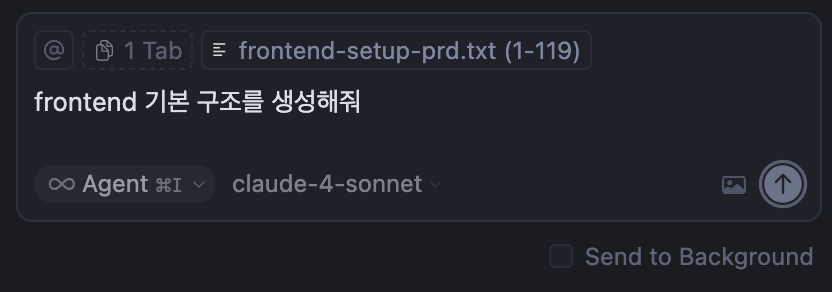

### 5) 모듈별 바이브코딩 실행하기
frontend-setup.txt를 통해 기본 구조가 생성되었다면 BoundedContext 하위에 생성된 FrontendPRD.txt에 작성된 내용을 새로운 Cursor AI Prompt창을 활성화하여 동일한 방법으로 바이브 코딩을 진행하면 이전에 설명한 Rule기반 프론트엔드 구현이 시작되는것을 확인할 수 있습니다.
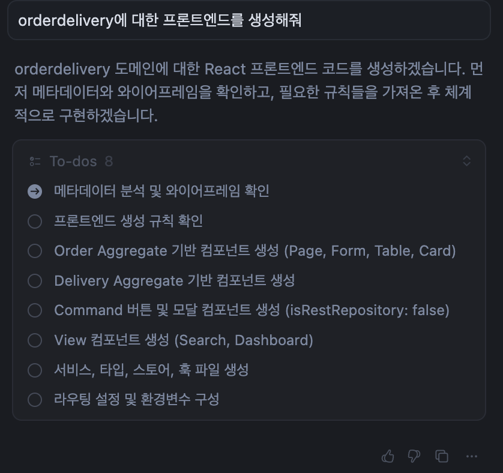

바이브 코딩이 완료되면, BoundedContext별 설계된 모델에 따른 UI와 wireframe에 따른 버튼 및 폼 생성이 진행된 프론트엔드 UI를 확인할 수 있습니다.

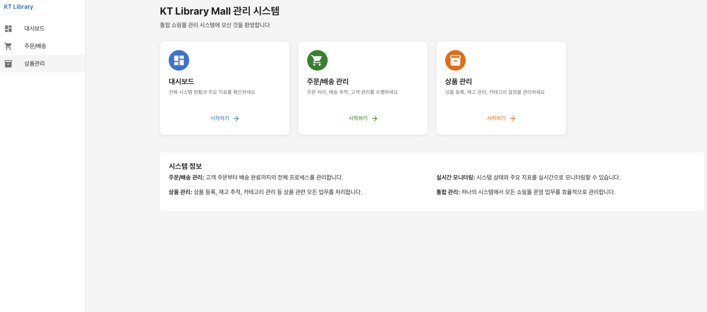

이를 통해 분석/설계를 통해 도출된 요구사항을 토대로 생성된 이벤트스토밍 모델이 구현단계의 요구사항으로 전달되어 설계와 구현의 일관성이 유지되고, 마이크로서비스 아키텍처 설계를 보장한 UI가 구현된 프론트엔드가 구현된것을 확인할 수 있습니다.